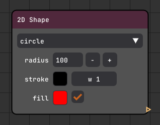

# NodiumPy

This is a very simple and minimal python application for node based image processing. The structure is very lean and
highly modular and allows for the existing nodes to be easily modified or for new nodes to be conveniently added.

My goal in writing this was to learn about dearpygui and flow based programming. The use case for this simple
application is merely educational and will benefit students or other enthusiasts wishing to develop a visceral and
practical understanding of how some image algorithms affect the input image and what the combination of these algorithms
will look like.


</br>
</br>

# Avalilable Nodes

<details>
<summary><strong>Input Nodes</strong></summary>
<table>

<tr>
<td width="140">Image</td>
<td width="300"></td>
<td>
This node opens a single image file (common image formats are supported).
</td>
</tr>

<tr>
<td>Image Folder</td>
<td></td>
<td>
This node allows retrieving a sequence of images in a specified directory. Also makes it possible to iterate and loop over the sequence.
</td>
</tr>

<tr>
<td>Screen Recorder</td>
<td></td>
<td>
Using this node, it is possible to capture the main screen or get all available screens (as a single large image). We can capture screen(s) as a single snapshot or a stream of snapshots.
</td>
</tr>

<tr>
<td>2D Shape</td>
<td></td>
<td>
This node creates several primitive 2D shapes with control over size, fill color, stroke color, and stroke weight.
</td>
</tr>

<tr>
<td>Video</td>
<td></td>
<td>
This node retrieve a video file and allows common video play functionality (playing, seeking, frame skip, and looping)
</td>
</tr>

<tr>
<td>Webcam</td>
<td></td>
<td>
As the name denotes, this node is for capturing image streams from connected webcams.
</td>
</tr>

</table>
</details>

<details>
<summary><strong>Adjustment Nodes</strong></summary>
<table>
<tr>
<td width="140">Crop</td>
<td width="300"></td>
<td>
Node for cropping an input image. It offers two modes for cropping: (1) center crop, and (2) two corner crop
</td>
</tr>

<tr>
<td>Flip</td>
<td></td>
<td>
Flips the input image either horizontally, vertically or both.
</td>
</tr>

<tr>
<td>Mask</td>
<td></td>
<td>
Applies a binary mask to an input image.
</td>
</tr>

<tr>
<td>Normalize</td>
<td></td>
<td>
Normalizes the input image using provided mean and std. 
</td>
</tr>

<tr>
<td>Resize</td>
<td></td>
<td>
Node for resizing the input image.
</td>
</tr>

<tr>
<td>Rotate</td>
<td></td>
<td>
Rotates the input image. There is an option for allowing reshaping of the rotated image, if off the rotated image is truncated, otherwise it will resize the rotated image such that no truncation happens.
</td>
</tr>

<tr>
<td>Threshold</td>
<td></td>
<td>
Node for thresholding input images.
</td>
</tr>

</table>
</details>

<details>
<summary><strong>Filter Nodes</strong></summary>
<table>
<tr>
<td width="140">Convolution</td>
<td width="300"></td>
<td>
This node applies convolution operation for a parameterized kernel and the input image. 
</td>
</tr>

<tr>
<td>Edge Detection</td>
<td></td>
<td>
This node allows for application of several edge detection algorithms on the input image.
</td>
</tr>

<tr>
<td>Light Enhancement</td>
<td></td>
<td>
Currently this node only offers an implementation of the VEVID algorithm from <em>PhyCV</em> library.
</td>
</tr>

<tr>
<td>Smoothing / Sharpening</td>
<td></td>
<td>
This node contains some of the common algorithms for smoothing and sharpening of the input image.
</td>
</tr>

<tr>
<td>Code Snippet</td>
<td></td>
<td>
We can use this node to write our own custom python filter code snippet. The variable "inImg" holds the reference to the input image and the variable "outImg" is the reference to the output image. 
</td>
</tr>
</table>
</details>

<details>
<summary><strong>Viewer Nodes</strong></summary>
<table>
<tr>
<td width="140">Canvas</td>
<td width="300"></td>
<td>
This node allows for composition of several input images into an output image. It supports layering, transforming, and several blending modes.
</td>
</tr>

<tr>
<td>Image View</td>
<td></td>
<td>
This node is used to visulize the output image or output image sequence. It has a context menu with entries for resizing and saving the displayed image.
</td>
</tr>
</table>
</details>

<details>
<summary><strong>Output Nodes</strong></summary>
<table>
<tr>
<td width="140">Image Writer</td>
<td width="300"></td>
<td>
Node for writing image files to disk.
</td>
</tr>

<tr>
<td>Video Writer</td>
<td></td>
<td>
Node for writing video files to disk.
</td>
</tr>
</table>
</details>
</br>

# Requirements

Python 3.11.3 and above is supported. All the required libraries can be installed using this line:

```
pip install dearpygui opencv-python Pillow
```

</br>

# Running

After setting up a python environment and installing the requirements, you can launch nodiumpy by running *main.py*

```
python main.py
```

</br>

# License

NodiumPy is licensed under Apache 2.0 License.
</br>
</br>

# Credits

+ Developed by Farzad Shayanfar
+ *[Jonathan Hoffstadt](https://github.com/hoffstadt)* and *[Preston Cothren](https://github.com/Pcothren)* and others
  for their work on *[DearPyGui](https://github.com/hoffstadt/DearPyGui)*
+ This work is highly inspired by
  *[Image-Processing-Node-Editor](https://github.com/Kazuhito00/Image-Processing-Node-Editor)* by
  *[Kazuhito Takahashi](https://github.com/Kazuhito00)*